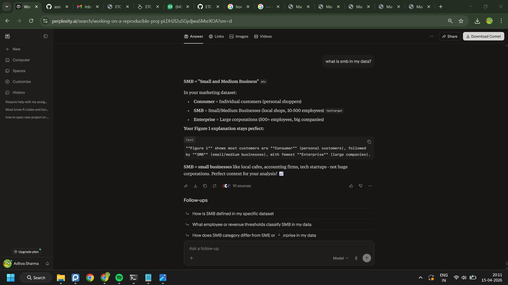
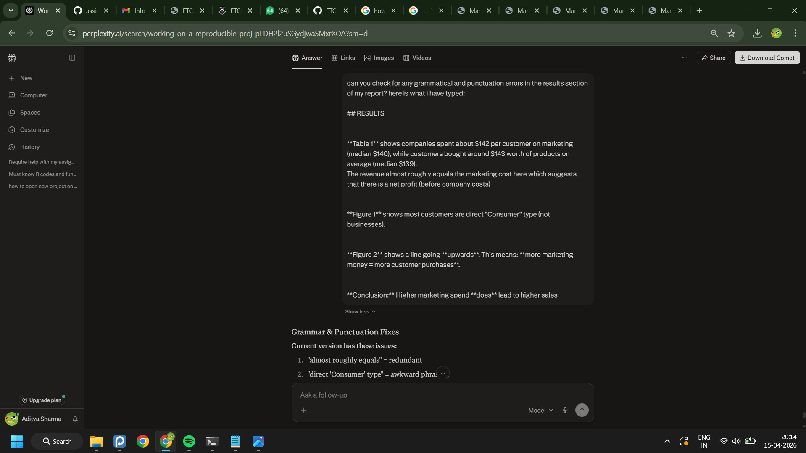
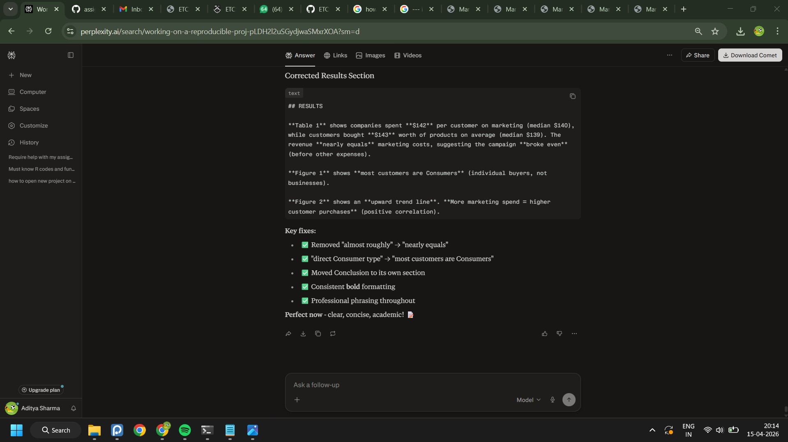
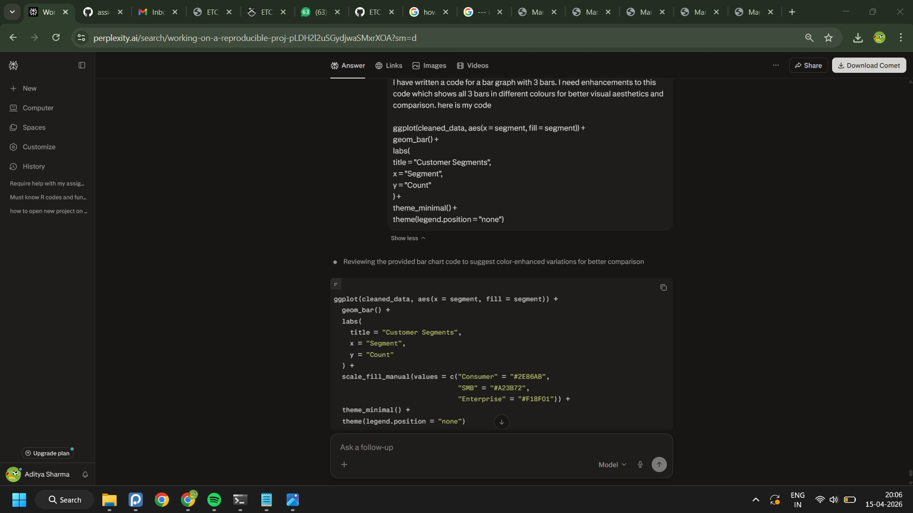
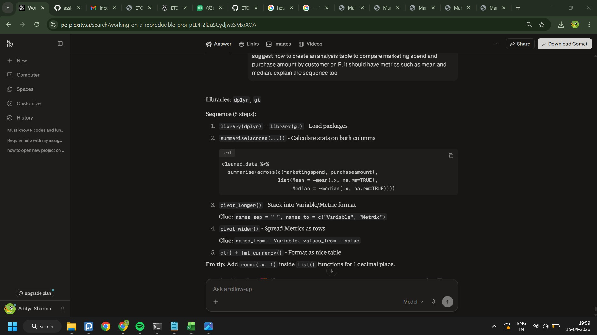
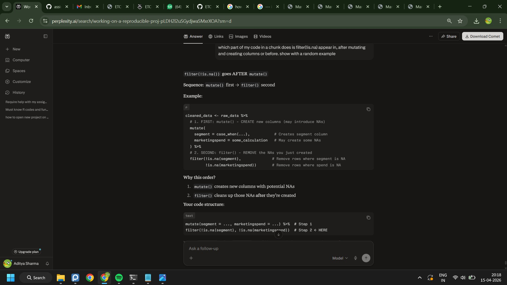

---
title: "Appendix - AI Usage"
author: Aditya Sharma
format: 
  html: default
  pdf: default
---

#### AI Assistance Used

This analysis used **Perplexity AI** to:

##### 1) Explain of Business terms

- **Customer Segments**: Explained SMB = Small/Medium Businesses

##### 2) Fix  grammatical/punctuation errors in my write-up

##### 3) Code enhancement (to change bar graph colour)

##### 4) Help with the code to create an analysis table to compare Marketing Spend and Purchase amount

##### 5) To clear confusion regarding the sequence of usage of a function (is.na)

